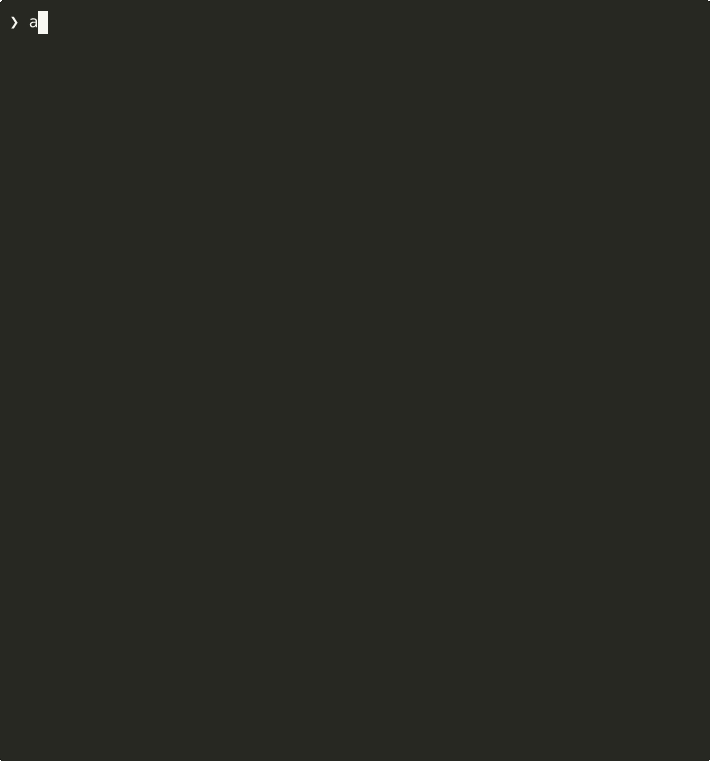

# auto-worktree

A bash tool for safely running AI agents in isolated git worktrees. Create separate workspaces for each task, issue, or PR review - keeping your main branch pristine.



## Features

- **Isolated Workspaces**: Each task gets its own worktree - no branch conflicts or stashed changes
- **Issue Tracking Integration**: Work on GitHub issues, GitLab issues, JIRA tickets, or Linear issues with automatic branch naming
- **GitHub PR Reviews**: Review pull requests in isolated worktrees
- **Interactive TUI**: Beautiful menus powered by Bubbletea
- **Auto-cleanup**: Detects merged PRs, closed issues, resolved JIRA tickets, and completed Linear issues
- **Random Names**: Generates memorable branch names like `work/coral-apex-beam`
- **Tab Completion**: Full zsh completion for commands, issues, and PRs
- **AI Agent Support**: Integrates with Claude Code, Codex CLI, or Gemini CLI
- **Tmux Session Management**: Persistent session tracking with pause/resume, status monitoring, and auto-dependency installation

## Safety Warning: Concurrent Git Operations

**IMPORTANT**: While git worktrees safely isolate branches and working directories, **git itself is not designed for concurrent operations**. Running multiple git commands simultaneously across different worktrees can cause repository corruption.

### What's Safe vs. Unsafe

**Safe - Worktrees prevent these problems:**
- Multiple branches checked out at once (each in its own worktree)
- Working on different features simultaneously in separate directories
- Switching context without stashing or committing incomplete work

**Unsafe - Concurrent git commands can corrupt your repository:**
```bash
# Running git operations in parallel across worktrees
cd worktree1 && git commit -m "change" &
cd worktree2 && git rebase main &
cd worktree3 && git push &
```

### Why This Matters

Git shares critical data across all worktrees:
- `.git/objects/` - Object database
- `.git/refs/` - References
- `.git/config` - Configuration
- `.git/hooks/` - Hooks
- Pack files and garbage collection

Running concurrent git commands can corrupt this shared data, even though each worktree has its own branch and working directory.

### Safe Practices

**Run git operations sequentially:**
```bash
cd worktree1 && git commit -m "change"
cd worktree2 && git commit -m "change"
cd worktree3 && git rebase main
```

**When using AI agents:**
- Only run one agent at a time per repository
- Pause or stop other agents before starting git operations
- Disable background git status checks in your IDE/tools
- See [AGENTS.md](AGENTS.md#safety-coordinating-multiple-ai-agents) for detailed guidance

**For more information:**
- [docs/BEST_PRACTICES.md](docs/BEST_PRACTICES.md) - Detailed safety guidelines and patterns
- [AGENTS.md](AGENTS.md#safety-coordinating-multiple-ai-agents) - AI agent coordination strategies

## Installation

### Prerequisites

#### Required

```bash
brew install gum jq
```

- **gum** - Terminal UI components
- **jq** - JSON processor

#### Optional (based on what you use)

**For GitHub:**
```bash
brew install gh
gh auth login
```

**For GitLab:**
```bash
brew install glab
glab auth login
```

**For JIRA:**
```bash
brew install ankitpokhrel/jira-cli/jira-cli
jira init
```

**For Linear:**
```bash
brew install schpet/tap/linear
# Or via Deno: deno install -A --reload -f -g -n linear jsr:@schpet/linear-cli
# Then set your API key:
export LINEAR_API_KEY=your_key_here  # Get from https://linear.app/settings/account/security
```

**For AI agents (choose one):**
- **Claude Code**: `brew install claude` or `npm install -g @anthropic-ai/claude-code`
- **Codex CLI**: `npm install -g @openai/codex-cli`
- **Gemini CLI**: See [gemini-cli](https://github.com/google/generative-ai-cli)

### Setup

Add to your `~/.zshrc`:

```bash
source /path/to/auto-worktree/aw.sh
```

This provides both the full `auto-worktree` command and a convenient `aw` shorthand alias that is **worktree-aware**:
- When developing auto-worktree itself, `aw` automatically uses your local changes
- In other repositories, `aw` uses the globally-installed version
- Both commands work identically - `aw` is just shorter to type

## Usage

Use either the full `auto-worktree` command or the shorter `aw` alias:

```bash
aw                             # Interactive menu
aw new                         # Create new worktree
aw issue [id]                  # Work on an issue (GitHub #123, GitLab #456, JIRA PROJ-123, or Linear TEAM-123)
aw pr [num]                    # Review a GitHub PR or GitLab MR
aw list                        # List existing worktrees with session status
aw sessions                    # View and manage active tmux sessions
aw settings                    # Configure per-repo settings
aw help                        # Show help
```

**Note:** `aw` and `auto-worktree` work identically. All examples below use `aw` for brevity.

### Create a New Worktree

```bash
aw new
```

Enter a branch name or leave blank for a random name like `work/mint-code-flux`.

### Work on Issues

The first time you run `aw issue`, you'll be prompted to choose between GitHub, GitLab, JIRA, or Linear for this repository. This preference is stored in git config.

**GitHub Issues:**
```bash
aw issue                   # Select from open issues
aw issue 42                # Work on issue #42 directly
```

Creates a branch like `work/42-fix-login-bug` and launches your AI agent.

**GitLab Issues:**
```bash
aw issue                   # Select from open GitLab issues
aw issue 42                # Work on issue #42 directly
```

Creates a branch like `work/42-fix-login-bug` and launches your AI agent.

**JIRA Issues:**
```bash
aw issue                   # Select from open JIRA issues
aw issue PROJ-123          # Work on JIRA-123 directly
```

Creates a branch like `work/PROJ-123-implement-feature` and launches your AI agent.

**Linear Issues:**
```bash
aw issue                   # Select from open Linear issues
aw issue TEAM-123          # Work on Linear issue TEAM-123 directly
```

Creates a branch like `work/TEAM-123-implement-feature` and launches your AI agent.

### Review a Pull Request

```bash
aw pr                      # Select from open PRs
aw pr 123                  # Review PR #123 directly
```

Checks out the PR in a new worktree and shows the diff stats.

### List Worktrees

```bash
aw list
```

Shows all worktrees with:
- Age indicators (green: recent, yellow: few days, red: stale)
- Merged PR/issue detection (GitHub and JIRA)
- Tmux session status for each worktree (running, paused, idle, failed)
- Cleanup prompts for merged, resolved, or stale worktrees

### Manage Tmux Sessions

```bash
aw sessions
```

View and interact with all active tmux sessions for worktrees:
- **Status indicators**: 🟢 running, ⏸️ paused, 💤 idle, ⚠️ needs attention, 🔴 failed
- **Session details**: Branch name, age, window count, dependency status
- **Interactive actions**: Attach to a session, pause, resume, or inspect details

**Session Status Meanings:**
- **Running** (🟢): Session is active and accessible
- **Paused** (⏸️): Session exists but marked as inactive
- **Idle** (💤): Session hasn't been accessed recently (default: 2 hours)
- **Failed** (🔴): Session encountered an error or tmux session was terminated
- **Needs Attention** (⚠️): Session requires user intervention

## Configuration

Issue provider settings are stored per-repository using git config. Use the
interactive Settings menu (or `aw settings`) to view and update project-specific
preferences.

```bash
# View current configuration
git config --get auto-worktree.issue-provider   # github, gitlab, jira, or linear

# Manual configuration for JIRA
git config auto-worktree.issue-provider jira
git config auto-worktree.jira-server https://your-company.atlassian.net
git config auto-worktree.jira-project PROJ      # Optional: default project filter

# Manual configuration for GitLab
git config auto-worktree.issue-provider gitlab
git config auto-worktree.gitlab-server https://gitlab.example.com  # Optional: for self-hosted
git config auto-worktree.gitlab-project group/project  # Optional: default project filter

# Manual configuration for Linear
git config auto-worktree.issue-provider linear
git config auto-worktree.linear-team TEAM       # Optional: default team filter

# Manual configuration for AI and auto-select
git config auto-worktree.ai-tool claude         # claude, codex, gemini, jules, skip
git config auto-worktree.issue-autoselect true  # true/false
git config auto-worktree.pr-autoselect true     # true/false

# Tmux session management configuration
git config auto-worktree.tmux-enabled true                 # Enable tmux (default: true)
git config auto-worktree.tmux-auto-install true            # Auto-install deps (default: true)
git config auto-worktree.tmux-layout tiled                 # Pane layout (default: tiled)
git config auto-worktree.tmux-window-count 1               # Initial windows (default: 1)
git config auto-worktree.tmux-idle-threshold 120           # Minutes before idle (default: 120)
git config auto-worktree.tmux-log-commands true            # Log commands (default: true)
```

Different repositories can use different issue providers and tmux configurations.

## How It Works

### Worktrees
1. **Worktrees** are stored in `~/worktrees/<repo-name>/`
2. Each worktree is a full copy of your repo on its own branch
3. Claude Code launches with `--dangerously-skip-permissions` for uninterrupted work
4. When done, use `list` to clean up merged worktrees and branches

### Tmux Session Management
1. **Session Metadata** is stored in `~/.auto-worktree/sessions/` with persistent state
2. **Auto-Detection** of project type and automatic dependency installation (npm, pip, cargo, etc.)
3. **Status Tracking** monitors session activity and automatically marks idle sessions
4. **Session Lifecycle** handles creation, pause, resume, and cleanup of sessions
5. **Atomic Operations** ensure metadata consistency even during concurrent access

## Example Workflows

### GitHub Workflow

```bash
# Start work on a GitHub issue
cd my-project
aw issue 42

# AI agent opens in ~/worktrees/my-project/work-42-add-feature/
# Make changes, commit, push, create PR

# Later, check for cleanup
aw list
# Shows "[merged #42]" indicator, prompts to clean up
```

### JIRA Workflow

```bash
# First time setup
cd my-work-project
aw issue
# Choose "JIRA" from the menu
# Enter JIRA server URL and project key

# Start work on a JIRA ticket
aw issue PROJ-456

# AI agent opens in ~/worktrees/my-work-project/work-PROJ-456-add-auth/
# Make changes, commit, push

# Later, when JIRA ticket is marked as Done
aw list
# Shows "[resolved PROJ-456]" indicator, prompts to clean up
```

### Linear Workflow

```bash
# First time setup
cd my-product-project
aw issue
# Choose "Linear Issues" from the menu
# Optionally enter default team key

# Start work on a Linear issue
aw issue TEAM-789

# AI agent opens in ~/worktrees/my-product-project/work-TEAM-789-add-feature/
# Make changes, commit, push

# Later, when Linear issue is marked as Done
aw list
# Shows "[completed TEAM-789]" indicator, prompts to clean up
```

## Tab Completion

The tool includes full zsh completion for both `aw` and `auto-worktree`:

```bash
aw <TAB>                   # Shows: new, issue, pr, list, settings, help
aw issue <TAB>             # Shows open issues from GitHub
aw pr <TAB>                # Shows open PRs from GitHub
```

## Development

### Code Quality and Validation

This project uses [ShellCheck](https://www.shellcheck.net/) to validate shell scripts and catch common bugs, portability issues, and code quality problems.

#### Running ShellCheck Locally

To validate all shell scripts in the repository:

```bash
scripts/shellcheck/validate_shell_scripts.sh
```

This will check all `.sh` files and report any issues found.

#### Pre-commit Hook (Optional)

Install the pre-commit hook to automatically validate shell scripts before each commit:

```bash
scripts/shellcheck/install_pre_commit_hook.sh
```

The hook will run ShellCheck on staged `.sh` files and prevent commits if issues are found. To bypass the hook for a single commit (not recommended):

```bash
git commit --no-verify
```

To uninstall the hook:

```bash
rm .git/hooks/pre-commit
```

#### CI/CD Validation

ShellCheck validation runs automatically on all pull requests via GitHub Actions. PRs must pass validation before they can be merged.

#### ShellCheck Configuration

The `.shellcheckrc` file configures which checks are enabled. Currently, many warnings are disabled to allow gradual improvement. As issues are fixed, warnings will be progressively enabled.

#### Installing ShellCheck

**macOS:**
```bash
brew install shellcheck
```

**Ubuntu/Debian:**
```bash
sudo apt-get install shellcheck
```

**Other platforms:** See [ShellCheck installation instructions](https://github.com/koalaman/shellcheck#installing)

## Why Worktrees?

- **No context switching**: Keep multiple tasks in progress without stashing
- **Clean isolation**: Claude Code changes won't affect other branches
- **Easy cleanup**: Delete the folder and branch when done
- **Parallel work**: Run multiple Claude Code sessions on different tasks

## License

MIT
